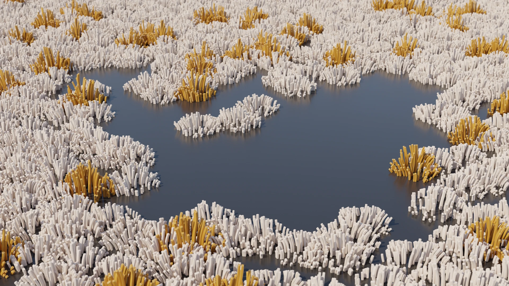

# Nature Scatter

Geometry Nodes for scattering of nature assets.

Download: [nature-scatter.blend](https://github.com/balazsfekete/nature-scatter/raw/main/nature-scatter.blend)

## Settings

- `Show Emitter` - Toggle to show input geometry.
- `Use Proxies` - Toggle to display instances as bounding box wireframes. This option affects only the viewport, renders will show full geometry of instances.
- `Viewport Display` - Change the ratio of instances displayed in the viewport. This option affects only the viewport, renders will show all instances.
- `Density Map` - Set a value or attribute as the interpolation parameter between Density 0 and Density 1.
- `Density 0` - Density used at Density Map values of 0.
- `Density 1` - Density used at Density Map values of 1.
- `Spacing` - Set minimum distance between instances.
- `Perimeter Culling` - Cull instances based on their distance from the perimeter. Positive values remove instances close to the perimeter. Negative values keep only instances close to the perimeter.
- `Slope Culling` - Cull instances based on the slope of the emitter. Positive values remove instances on steep areas. Negative values keep only instances on steep areas
- `Follow Normal` - Set how much instances follow the surface of the emitter. 0 is vertical, 1 is aligned with the normal.
- `Tilt` - Rotate instances along the X and Y axis. The rotation angle is random between 0 and the tilt value.
- `Scale Map` - Set a value or attribute as the interpolation parameter between Scale 0 and Scale 1.
- `Scale 0` - Scale used at Scale Map values of 0.
- `Scale 1` - Scale used at Scale Map values of 1.
- `Scale Variation` - Multiply scale by a random value between 1/value and value.
- `Placement Seed` - Randomize instance placement.
- `Rotation Seed` - Randomize rotation around the Z axis and tilt.
- `Scale Seed` - Randomize scale variation.

---

_Made with Blender 3.2.0_
